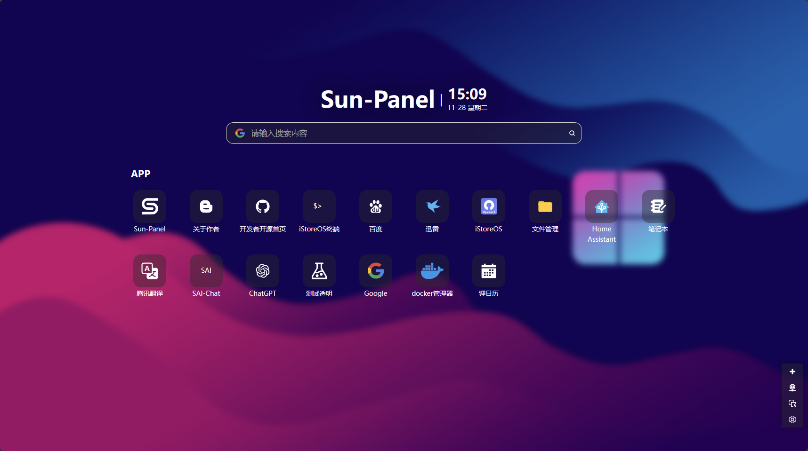
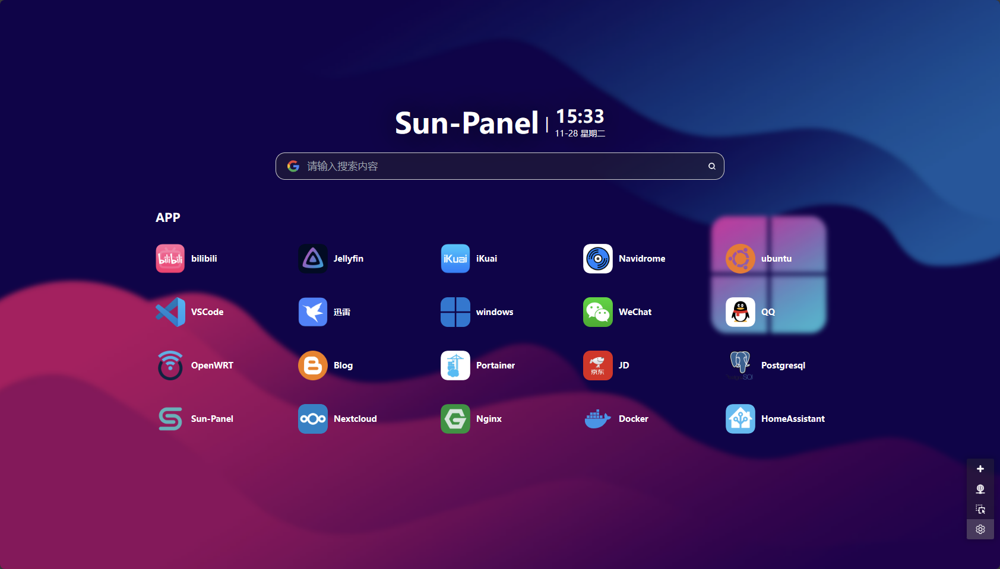
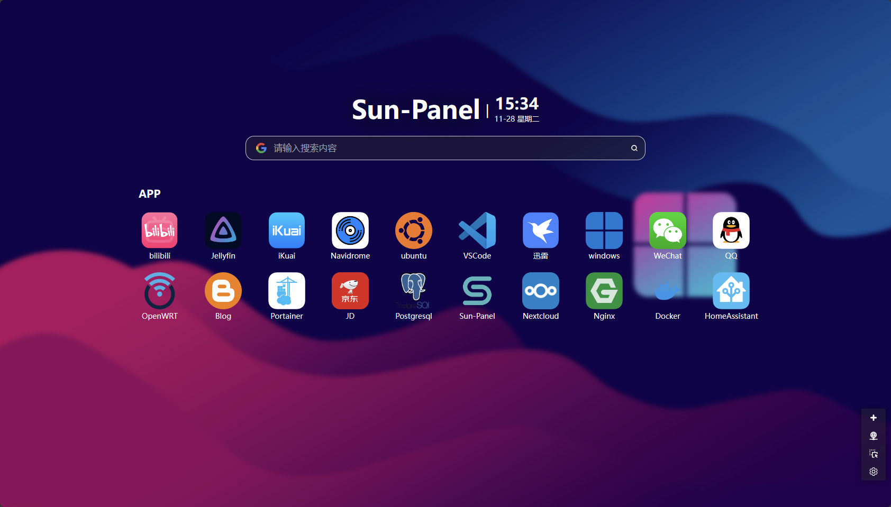
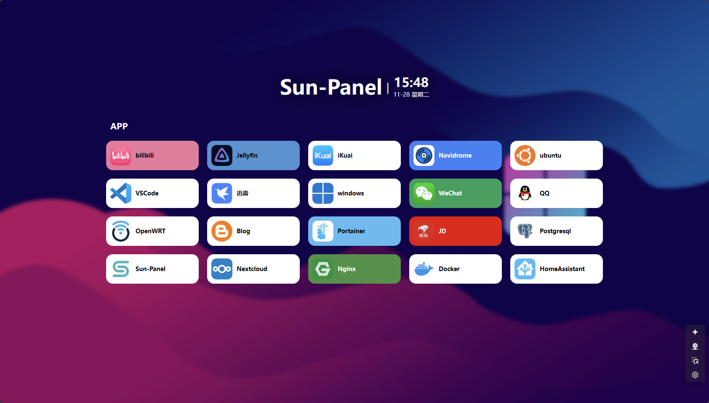
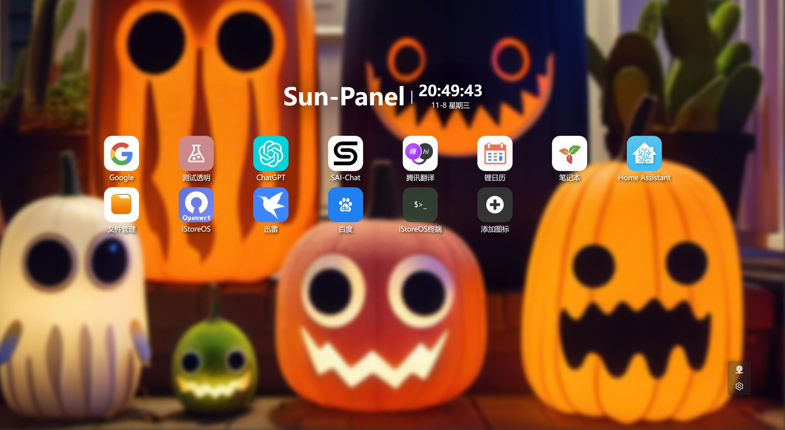
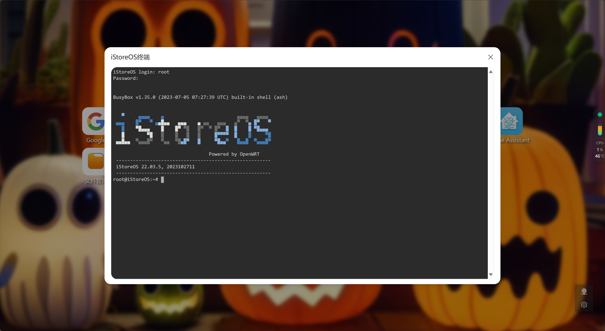
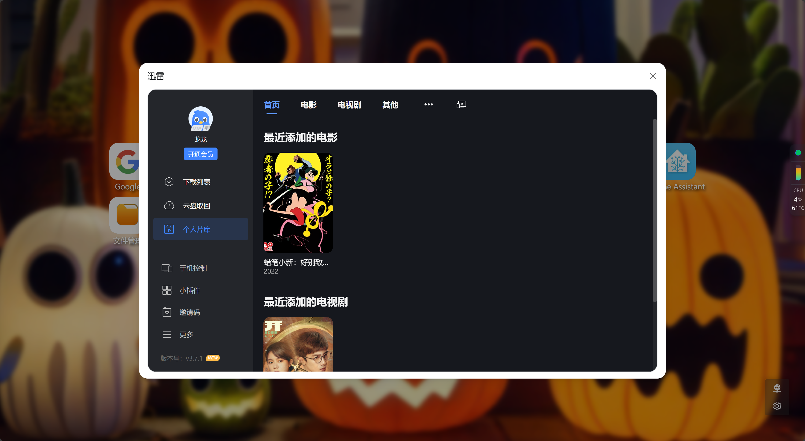

[[ 简体中文 ]](https://sun-panel-doc.enianteam.com/zh_cn/introduce/project.html) |
[[ English ]](https://sun-panel-doc.enianteam.com/introduce/project.html)

# Sun-Panel-V2

一个基于Sun-Panel修改的版本,因原版无书签功能导入直接就到首影响速度,所以做了修改,增加了浏览器的导入书签的功能,使其主页和书签功能分开

Sun-Panel-V2 一个服务器、NAS导航面板、Homepage、浏览器首页、书签。

## 😎 Features

- 🍉 Clean interface, powerful functionality, low resource consumption
- 🍊 Easy to use, visual operation, zero-code usage
- 🍠 One-click switch between internal and external network modes
- 🍵 Supports Docker deployment (compatible with Arm systems)
- 🎪 Supports multi-account isolation
- 🎏 Supports viewing system status
- 🫙 Supports custom JS, CSS
- 🍻 Simple usage without the need to connect to an external database
- 🍾 Rich icon styles for free combination, supports [Iconify icon library](https://icon-sets.iconify.design/)
- 🚁 Supports opening small windows in the webpage (some third-party websites may block this feature)

## 🖼️ Preview Screenshots

**Various styles, freely combined**

**Built-in small windows**

## 🐳 Deployment tutorial
[Deployment Tutorial](https://sun-panel-doc.enianteam.com/usage/quick_deploy.html)

## 🍵 Donate

> Open-source development is not easy. If you feel that my project has helped you, you are welcome to [donate](./doc/donate.md) or buy me a cup of tea☕ (please leave your nickname or name in the note if possible). Your support is my motivation, thank you.

<a href="https://www.paypal.me/hslrs">
</img>
</a>

|   |   |
| ------------ | ------------ |
|  |   |

## 🏖️ Communication group & community

Author：**[红烧猎人](https://blog.enianteam.com/u/sun/content/11)**

[Github Discussions](https://github.com/75412701/sun-panel-v2/discussions)

## ❤️ Thanks

- [Roc](https://github.com/RocCheng)
- [jackloves111](https://github.com/jackloves111)
- [Rock.L](https://github.com/gitlyp)

---

