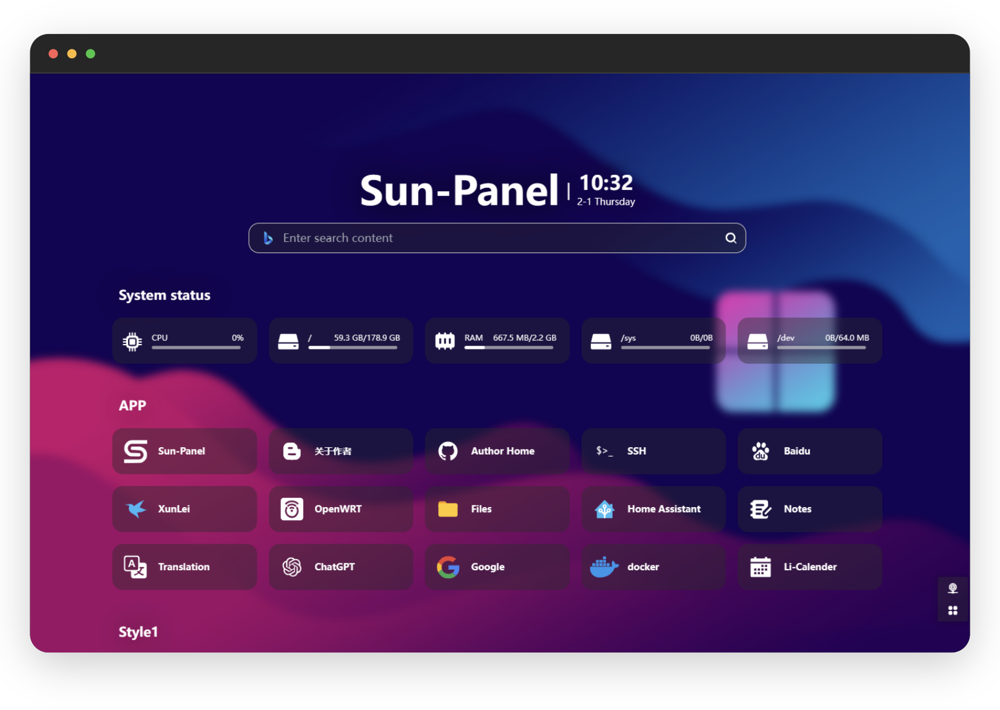
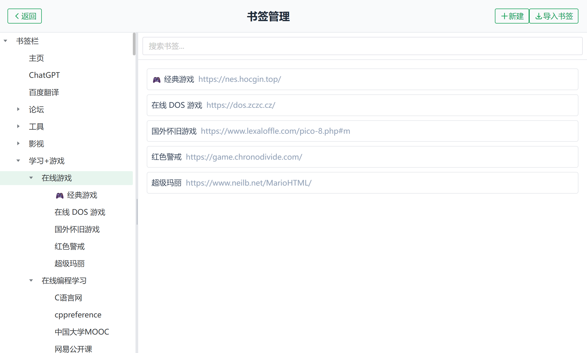
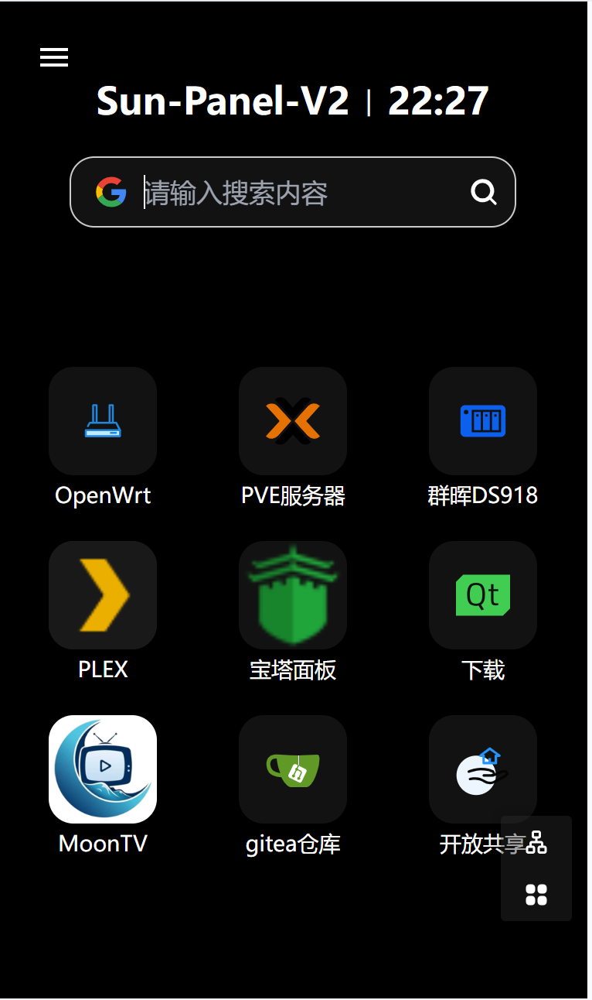
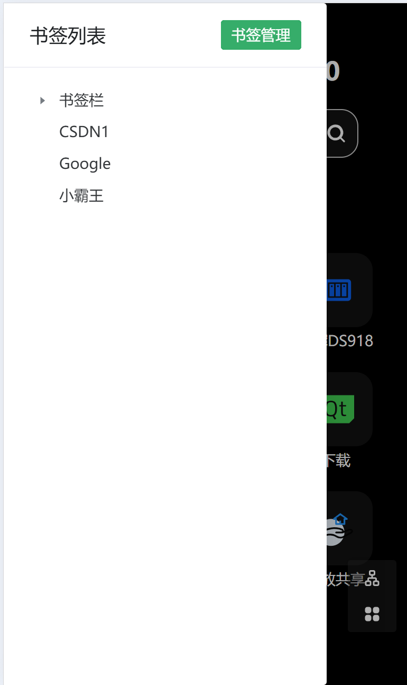

<div align=center>


# Sun-Panel-V2

一个基于[Sun-Panel](https://github.com/hslr-s/sun-panel)   修改的版本,增加了浏览器的导入书签的功能,使其主页和书签功能分开

Sun-Panel-V2 一个服务器、NAS导航面板、Homepage、浏览器首页、书签。

个人自用版本,后续会持续更新完善,如果你也喜欢建议点亮右上角星星避免后续迷路
</div>







## 🖼️ Preview Screenshots


## 部署
本项目支持 Docker 或其他基于 Docker 的平台部署。<br>
1.编写docker-compose.yml文件<br>
2.运行docker-compose up -d<br>
3.打开 域名/ip:3002<br><br><br>
账号:admin<br>
密码:123456
### docker

```yml
version: "3.2"

services:
  sun-panel:
    image: 'ghcr.io/75412701/sun-panel-v2:latest'
    container_name: sun-panel-v2
    volumes:
      - ./conf:/app/conf
      - ./uploads:/app/uploads
      - ./database:/app/database
    # - ./runtime:/app/runtime
    ports:
      - 3002:3002
    restart: always
```

## 🍵 捐赠

> 开源开发并不容易。如果你觉得我的项目对你有所帮助，欢迎你[捐款](./doc/donate.md)或请我喝杯茶☕（如果可能的话，请在备注中留下你的昵称或姓名）。你的支持就是我的动力，谢谢。


## ❤️ Thanks

- [红烧猎人](https://blog.enianteam.com/u/sun/content/11)

---

[](https://star-history.com/#hslr-s/sun-panel&Date)
